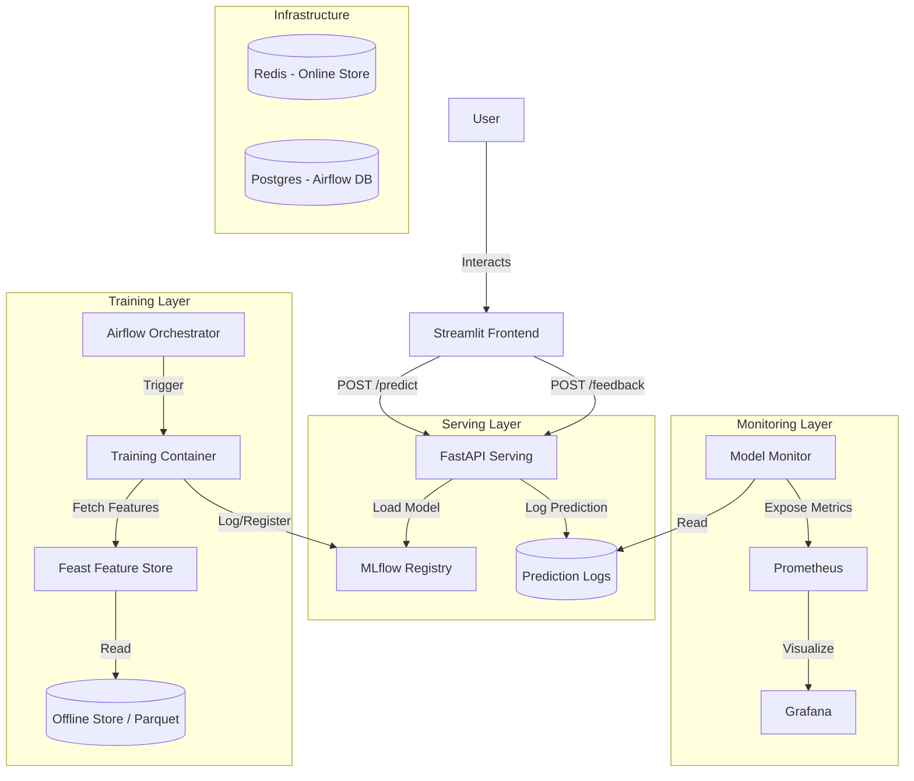

# End-to-End MLOps Project: Sentiment Analysis

This project implements a complete MLOps pipeline for Sentiment Analysis using the Amazon Reviews dataset. It features a model serving API, a user-friendly frontend, a feature store, automated retraining, and a comprehensive observability stack.

## Stack
- **Serving**: FastAPI (Model Inference)
- **Frontend**: Streamlit (User Interface)
- **Feature Store**: Feast (Offline & Online Feature Management)
- **Orchestration**: Airflow (Pipeline Automation)
- **Tracking**: MLflow (Model Registry & Experiment Tracking)
- **Monitoring**: Prometheus + Grafana (Infrastructure & Model Quality)
- **Infrastructure**: Docker Compose (Redis, Postgres, etc.)

## Architecture



## Directory Structure
- `airflow/`: Airflow DAGs and configuration.
- `data/`: Raw and processed data.
- `feature_store/`: Feast feature definitions and configuration.
- `frontend/`: Streamlit application source code.
- `mlflow_data/`: MLflow artifact storage.
- `monitoring/`: Prometheus, Grafana, and Model Monitor service.
- `serving/`: FastAPI application source code.
- `training/`: Training scripts (including Fast Retrain).
- `docker-compose.yml`: Service orchestration.

## Key Features

### 1. Model Serving & Feedback Loop
The FastAPI service provides real-time predictions. A Streamlit frontend allows users to input reviews and provides a "Thumbs Up/Down" feedback mechanism. This feedback is logged and used for monitoring and retraining.

### 2. Fast Retraining Strategy
A "Fast Retraining" pipeline runs weekly (via Airflow). It:
1.  Clones the hyperparameters of the current **Production** model from MLflow.
2.  Fetches the last 90 days of data from the Feature Store.
3.  Retrains the model on this fresh data.
4.  Promotes the new model if it maintains or improves performance (F1 Score).

### 3. Observability
- **Infrastructure**: CPU/Memory usage tracked via Prometheus/Grafana.
- **Model Quality**: Accuracy and F1 score are calculated in real-time by the `model-monitor` service based on user feedback.

## How to Run

1. **Start Infrastructure**:
   ```bash
   docker compose up --build -d
   ```

2. **Access Services**:
   - **Frontend**: [http://localhost:8501](http://localhost:8501)
   - **API**: [http://localhost:8000/docs](http://localhost:8000/docs)
   - **Airflow**: [http://localhost:8080](http://localhost:8080) (User/Pass: `airflow`/`airflow`)
   - **MLflow**: [http://localhost:5001](http://localhost:5001)
   - **Grafana**: [http://localhost:3000](http://localhost:3000) (User/Pass: `admin`/`admin`)
   - **Prometheus**: [http://localhost:9090](http://localhost:9090)

3. **Trigger Retraining**:
   - Access Airflow and trigger the `fast_retrain_dag` manually to test the retraining pipeline.
